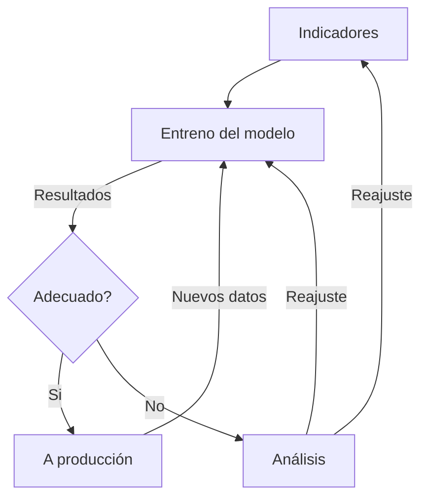

# Some images 

```mermaid
graph TD;
    A["Indicadores"]-->B["Entreno del modelo"];
    B-->|Resultados|C{"Adecuado?"};
    C-->|Si|D["A producción"];
    D-->|Nuevos datos|B;
    C-->|No|E["Análisis"];
    E-->|Reajuste|A;
    E-->|Reajuste|B;
```

